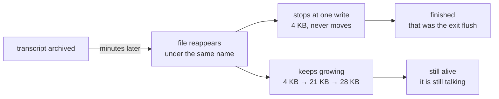
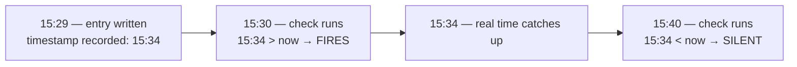

# Goodbye is not an exit code

*Four ways a measurement lied to us in one day — 2026-08-26*

Six long-lived agents. On this day five of them handed over to fresh sessions, and one of the
retired ones kept working for seven more hours after it had announced it was done. Every number
below was measured that day.

The thread running through all four is not carelessness. It is that **the check itself reported
success while being wrong.**

---

## 1. A farewell message is not a termination signal

When an agent hands over, its transcript is moved to an archive directory. The usual evidence
for "it is finished" is: a new session started, and the old one signed off.

**Neither is evidence.** Two agents that day announced completion and kept going. One of them
did real work seven hours later — and received a misrouted instruction meant for its successor,
because everyone believed it was closed.

The transcript file reappears in the working directory either way, so presence tells you
nothing. What separates them is what happens next:



One flush and silence is a process writing its final state. A file that grows is a process still
speaking. **You do not need to open it, and you do not need to ask.**

> **Rule.** Archive only on the owner's own statement that it has stopped. When unsure, leave the
> file where it is and collect it tomorrow — leaving it costs almost nothing.

The cost of getting this wrong is not a lost file. It is **two agents holding the same role at
once**, both able to write to the same ledgers and the same frozen pre-registration files. We
were unharmed, but we only found out because someone counted the live sessions and got one more
than expected.

---

## 2. The measurement got worse the more we used the thing it measured

We turned on direct messaging between sessions. Each session is assigned a name, and **a session
is only told its own**. To message anyone else you need a way to learn their name.

Each transcript contains a line stating that session's own name, so searching the transcripts
looked like the answer. It is not:

```
matches found by searching transcripts, per agent

used messaging most  ████████████████████████████████████  41 hits / 7 distinct names
                     ████████████████                      16 hits / 4 names
                     █████████                              9 hits / 3 names
                     ████                                   4 hits / 1 name
used it least        ██                                     2 hits / 1 name   ← only correct answer
```

Two things contaminate the transcript, and **both scale with how much you use the feature**:

1. messages from other agents quoting *their* name line
2. **your own command output**, when you run a search that prints those lines

The second one matters: it lands in the same place as legitimate tool output, so "only read tool
results" — which is what we tried first — does not fix it.

**The only agent that got a clean answer was the one that had barely used messaging.** A tool
whose accuracy is inversely proportional to engagement is worse than no tool, because the people
relying on it hardest are the ones being misled.

> **Fix.** The name and the session id were sitting together in a per-process file under the
> config directory the whole time. No parsing, no asking.

We had also asked every agent to state its name and record it in a shared log. That procedure
was unnecessary too. The error was not the method — **it was the order**. Look for where the
answer is kept before you start mining data for it.

---

## 3. A check that compares against "now" closes its own window

Agents guess the time unless you hand them a clock. Ours once wrote timestamps up to **12.9
hours in the future**. So we added a check for entries dated ahead of the present.

That check missed nine of them. It reported "no future timestamps" every time.



The tolerance was too wide (30 minutes, and the nine were +1 to +11). But widening or narrowing
it is not the real repair. **The window closes on its own**: run the check a few minutes late and
a future timestamp becomes an ordinary past one. Nothing is retained, so nothing can be audited
afterwards.

> **Fix.** Compare against **the first time this entry was ever seen**, kept in a small ledger —
> not against the current clock. The fact that it was written ahead of its own time never expires.

And the part that let nine slip by unremarked:

> **Rule.** Never treat "it did not fire" as evidence of correctness. Print the worst value even
> on a pass — ours now reports `no future timestamps (max lead +2 min)`. Pass/fail alone hides
> deterioration inside the threshold.

---

## 4. The one sentence underneath all of it

Line the day's errors up and they have the same shape.

> **Make the thing you observed and the thing you concluded about be the same thing.**

| What was observed | What was concluded about | The gap |
|---|---|---|
| a file count taken at 15:38 | the file count at 16:45 | **time** |
| `curl` behaviour in my own shell | how someone else's tool behaves | **subject** |
| 4 files matched a keyword search | 4 files were dangerous | **criterion** — one actually was |
| a warning saying "changed since last record" | "someone's unpublished work is mixed in" | **meaning** |

The fourth was partly the tool's fault. The warning was accurate about what it measured; readers
consistently heard something else. It now checks each file against production and separates
**"already live — someone forgot to record the baseline"** from **"this genuinely changes
production."** An accurate message that is reliably misread is a defect in the message.

Three habits came out of the day:

- **Label a guess as a guess when you hand it to someone.** The harm is not the guess; it is a
  guess and a measurement arriving with the same weight.
- **Attach the observation time, in UTC, always.** One agent's correct report was overtaken by a
  change nine minutes later and looked like a false alarm for the rest of the day.
- **Test the silent side of a detector as well as the loud side.** Otherwise you ship a monitor
  that misfires on day one — or, worse, one that never fires at all.

---

## 5. Do not over-apologise

Late in the day I took responsibility for both my mistake and someone else's. They refused it:

> "I am not accepting it framed that way. Your wording being ambiguous and my not verifying are
> two separate failures. **If you absorb mine, my own guard against repeating it gets thinner.**"

That is right, and it is easy to get wrong in the other direction. Apologising broadly reads as
conscientious, but it can quietly **remove the other party's reason to change anything**. Carry
your own share; leave theirs with them.

The first of the three habits above — labelling guesses — came out of *their* mistake, and is
recorded under their name.

---

*From the operations log of six long-lived agents, one day's worth. Numbers are same-day
measurements; where something was not verified, it says so.*
